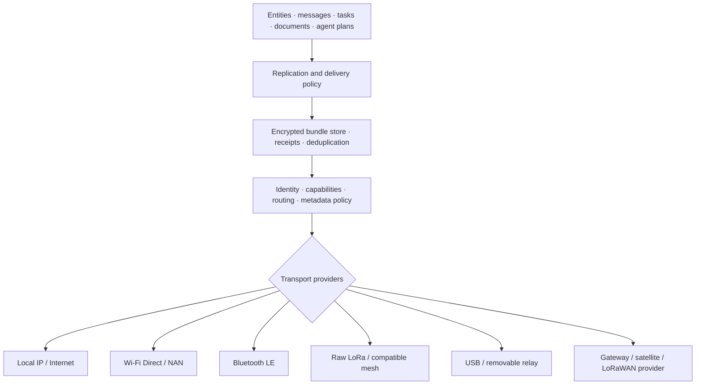

# Agent Mesh: Multi-Transport Peer Connectivity

## Product position

Agent Mesh is a system capability, not a messenger application and not a LoRa-specific feature. Documents, messages, tasks, entity updates, action requests, emergency beacons, and agent handoffs use one signed envelope and delivery policy while the operating system chooses one or more transports.

Applications and micro-apps request an outcome such as “deliver this urgent message within 24 hours without paid connectivity.” They do not choose a radio, manage a mesh, or receive ambient network authority.

## Layer model

## Core contracts

- `MeshEnvelope`: stable ID, sender identity, recipients, content type, content hash, creation/expiry, priority, hop and custody policy.
- `MeshTransport`: discovery, link metrics, maximum payload, energy and airtime cost, region constraints, send/cancel/status.
- `BundleStore`: encrypted persistence, deduplication, retry scheduling, custody acknowledgements, expiry and deletion.
- `RoutePolicy`: direct versus relay, maximum hops, metadata exposure, transport duplication, battery and airtime budgets.
- `NeighbourObservation`: rotating peer identifier, transport, contact window and bounded link quality.
- `DeliveryReceipt`: accepted, relayed, delivered, expired, rejected or compensated; receipts are semantic-history events.

## Routing principles

1. Prefer direct local delivery when authority, cost, energy and latency allow it.
2. Use multiple transports for emergency or deadline-bound envelopes when policy permits.
3. Treat every relay as untrusted; payload confidentiality and authenticity are end-to-end.
4. Preserve envelopes across shutdown and loss of connectivity without keeping the main SoC awake.
5. Do not promise delivery when no route exists; expose typed pending, delayed, partial and expired states.
6. Keep raw radio configuration behind a region-aware system capability.

## LoRa role

LoRa carries short text, coordinates, acknowledgements, hashes, manifests, compact CRDT operations, presence and rendezvous requests. It does not carry photographs, ordinary document bodies, audio or video. Large content is announced by ID/hash and transferred later through a faster path.

LoRaWAN remains a separate infrastructure provider. Peer-to-peer Agent Mesh uses raw LoRa or a compatible mesh protocol because ordinary LoRaWAN is gateway/network-server oriented.

## Compatibility providers

The first implementation should support an external Meshtastic-compatible node over BLE/USB for field evidence. Native providers may later support SX1262-class radios, Reticulum-compatible routing, MeshCore-style constrained links, Wi-Fi Aware, BLE and local IP. Compatibility does not change Agent Mesh envelope semantics.

## Safety and privacy

- end-to-end encryption and signed envelopes;
- rotating link identifiers and metadata minimisation;
- replay protection and deduplication;
- storage, relay, airtime and battery quotas;
- sender reputation and invitation/capability-based relay admission;
- emergency priority with abuse controls;
- no silent fallback to public broadcast or weaker encryption;
- inspectable receipts, expiry and remote/local deletion semantics.

## Conformance evidence

A provider is conformant only after simulator and field tests cover duplicate paths, delayed encounters, revoked identities, malicious relays, replay, flooding, low battery, region-policy denial, shutdown handoff, expiry and recovery. Evidence records bytes, airtime, current draw, latency percentiles, delivery ratio, metadata exposed and every payload copy.

## Related documents

- [Storage, entity graph, history and sync](AOS-ARCH-009.md)
- [Agent runtime and action safety](AOS-ARCH-010.md)
- [Power, thermal and background execution](AOS-ARCH-014.md)
- [Security architecture and threat model](AOS-ARCH-012.md)
- [Off-grid peer experience](../product/PROD-017-off-grid-peer-experience.md)
- [LoRa hardware track](../hardware/HW-018-lora-mesh-hardware.md)
- [Radio compliance](../legal/LEGAL-015-regional-radio-compliance.md)
- [Mesh and DTN prior art](../research/RES-017-mesh-dtn-prior-art.md)
